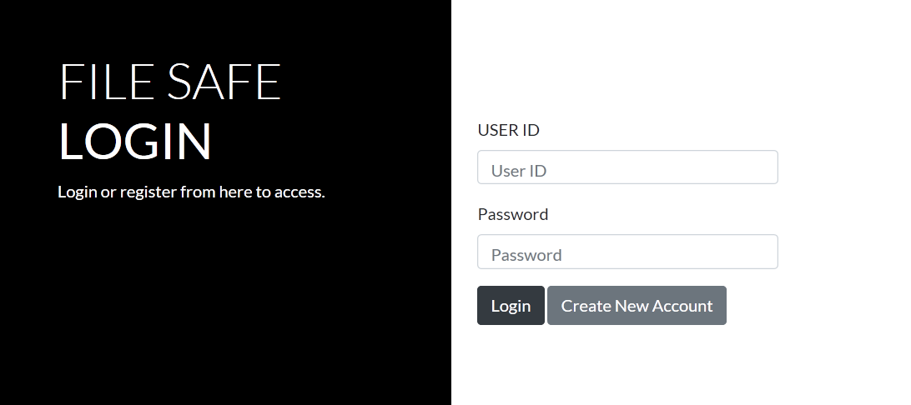

# FILE SAFE


### TECH STACK:

- FRONTEND : JSP, HTML5 AND CSS3
- BACKEND : JAVA SERVLET AND MySQL DB SERVER


### DESCRIPTION 
```
IN THIS PROJECT A USER CAN UPLOAD FILES TO DB AND STORE THEM SECURELY USING MODERN ENCRYPTION ALGORITHMNS

FILES ARE PROTECTED WITH A PASSWORD FROM DIRECT DOWNLOAD TO SAFEGUARD THE ACCESSIBILITY

LATER ONCE THE FILE IS UPLOAD USER CAN VIEW THEIR FILES AND RENAME OR DELETE THEM ACCORDINGLY

```


### SCREENSHOT


